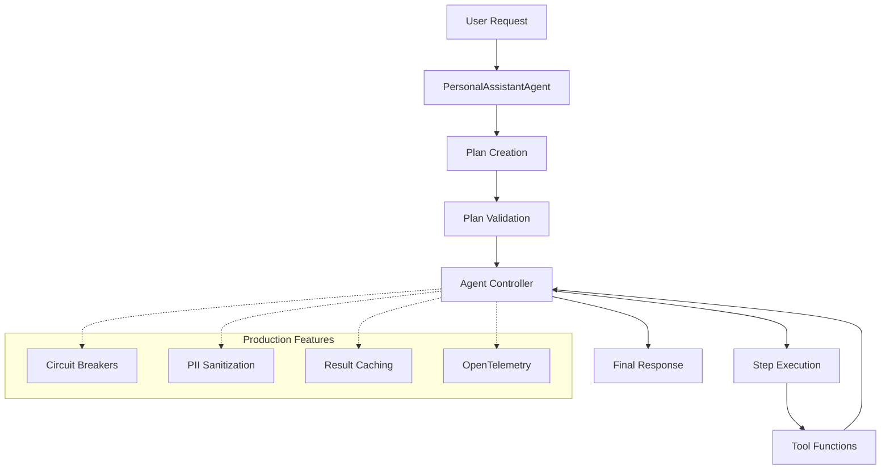

# Personal Assistant Architecture

## Overview

The Personal Assistant is a production-grade AI agent built with a **Planner-Executor architecture** that eliminates ReAct drift and provides enterprise-level reliability, observability, and safety.

## Architecture Principles

- **Framework-Agnostic Core**: Business logic isolated from I/O adapters
- **Separation of Concerns**: Clean boundaries between planning, execution, and infrastructure  
- **Production Hardening**: Circuit breakers, PII sanitization, validation, telemetry
- **Testability**: Comprehensive unit, integration, and end-to-end test coverage

## High-Level Flow



## Directory Structure

```
src/personal_assistant/
├── core/                  # Production-stable business logic
│   ├── agent.py          # Main facade and entry point
│   ├── controller.py     # Orchestrates planner-executor flow
│   ├── registry.py       # Tool metadata and caching
│   ├── validator.py      # Plan validation and safety checks
│   ├── circuit_breaker.py # Hystrix-style failure isolation
│   ├── sanitizer.py      # PII detection and redaction
│   ├── telemetry.py      # OpenTelemetry integration
│   ├── dag.py            # DAG parallelism controller
│   └── errors.py         # Centralized error handling
├── adapters/             # Framework integration boundaries
│   ├── nat.py           # NeMo Agent Toolkit adapter
│   └── webui.py         # Web UI adapter  
├── tools/               # Business tool implementations
├── data/                # Configuration and schemas
└── legacy/              # Deprecated code (scheduled for removal)
```

## Core Components

### 1. PersonalAssistantAgent (`core/agent.py`)
- **Role**: Public API facade
- **Responsibilities**: Request orchestration, metrics logging, state management
- **Key Features**: Circuit breaker integration, PII sanitization, error handling

### 2. AgentController (`core/controller.py`)  
- **Role**: Planner-Executor orchestration
- **Responsibilities**: Plan creation, step execution, retry logic, deadline enforcement
- **Key Features**: Caching, idempotency, compensating reads

### 3. ToolRegistry (`core/registry.py`)
- **Role**: Tool metadata management
- **Responsibilities**: Schema validation, purity tracking, cache management
- **Key Features**: TTL-based caching, parallelism hints, normalization rules

### 4. Validator (`core/validator.py`)
- **Role**: Front-gate plan validation
- **Responsibilities**: Schema checks, cycle detection, topological sorting
- **Key Features**: Mathematical correctness, standardized error codes

### 5. CircuitBreaker (`core/circuit_breaker.py`)
- **Role**: Tool-level failure isolation
- **Responsibilities**: Rolling window tracking, failure rate monitoring
- **Key Features**: Hystrix-style implementation, per-tool state management

## Data Flow

### 1. Request Processing
```
User Request → Input Sanitization → Plan Creation → Plan Validation
```

### 2. Plan Execution
```
Plan → Step-by-Step Execution → Tool Calls → Result Aggregation → Response
```

### 3. Production Features (Cross-Cutting)
```
Circuit Breaker Check → Cache Lookup → Tool Execution → PII Sanitization → Telemetry
```

## Planner-Executor Pattern

### Why Not ReAct?
ReAct agents suffer from "drift" - they lose context in multi-step scenarios and enter analysis loops instead of proceeding with execution.

### Planner-Executor Benefits
- **Deterministic**: Plans are validated JSON structures
- **Traceable**: Every step is explicit and logged  
- **Recoverable**: Failed steps can be retried or compensated
- **Parallel**: DAG dependencies enable concurrent execution

### Plan Structure
```json
{
  "plan": [
    {
      "id": "s1",
      "step": 1,
      "tool": "add_task", 
      "input": {"description": "Demo Task"},
      "after": []
    },
    {
      "id": "s2", 
      "step": 2,
      "tool": "list_tasks",
      "input": {},
      "after": ["s1"]
    }
  ]
}
```

## Production Hardening Features

### 1. Circuit Breakers
- **5-minute rolling window** (30s buckets × 10)
- **70% failure threshold** with 50+ request minimum
- **60s cool-down** before half-open retry
- **Per-tool isolation** prevents cascade failures

### 2. PII Sanitization
- **Regex-based detection**: emails, phones, credit cards, SSNs, IBANs
- **Safe redaction**: `[REDACTED:EMAIL]`, `[REDACTED:PHONE]`
- **Recursive processing**: handles nested JSON structures
- **Observation filtering**: applied before LLM consumption

### 3. Result Caching
- **Pure tools**: Infinite cache (deterministic results)
- **Read-only tools**: TTL-based cache (1-300s depending on tool)
- **Impure tools**: No caching (state-modifying operations)

### 4. Validation & Safety
- **JSON Schema validation** for all plans and tool inputs
- **Cycle detection** prevents infinite dependency loops  
- **Topological sorting** ensures correct execution order
- **Budget enforcement** prevents runaway execution

### 5. Observability
- **OpenTelemetry traces** with spans for each operation
- **Structured logging** with consistent format
- **Performance metrics** including cache hit rates
- **Error categorization** with standardized codes

## Tool Purity System

### Pure Tools
- **Characteristics**: Deterministic, no side effects
- **Examples**: `calculate_percentage`, mathematical operations
- **Caching**: Infinite TTL (results never change)
- **Parallelism**: Fully safe

### Read-Only Tools  
- **Characteristics**: No mutations, but results may change over time
- **Examples**: `list_tasks`, `get_current_time`
- **Caching**: Short TTL (1-60s)
- **Parallelism**: Safe with other read-only tools

### Impure Tools
- **Characteristics**: Modify state, have side effects
- **Examples**: `add_task`, `delete_task`
- **Caching**: None (always execute)
- **Parallelism**: Not safe, requires sequential execution

## Error Handling

### Error Categories
- **E_SCHEMA**: JSON schema violations
- **E_CYCLE**: Circular dependencies in plan
- **E_TOOL_UNKNOWN**: References to undefined tools
- **E_TIMEOUT**: Tool execution timeout
- **E_CIRCUIT_OPEN**: Circuit breaker protection

### Recovery Strategies
- **Exponential backoff** for transient failures
- **Compensating reads** for failed mutations
- **Partial responses** for deadline violations  
- **Graceful degradation** with circuit breakers

## Configuration

### Environment Variables
- `PA_PROFILE`: Configuration profile (planner-executor, ollama-tool-calling)
- `OTEL_EXPORTER_OTLP_ENDPOINT`: OpenTelemetry collector endpoint
- `PA_LOG_LEVEL`: Logging verbosity (INFO, DEBUG, WARNING, ERROR)

### Profile Selection
1. **planner-executor.yml**: Production planner-executor (recommended)
2. **ollama-tool-calling.yml**: Direct tool calling mode
3. **legacy-react.yml**: Deprecated ReAct mode (do not use)

## Testing Strategy

### Test Layers
- **Unit Tests** (`tests/unit/`): Individual component testing
- **Integration Tests** (`tests/integration/`): End-to-end flow testing  
- **E2E Tests** (`tests/e2e/`): Full system testing including UI

### Golden Test Suite
The **7 Golden Tests** in `tests/integration/test_agent_pipeline.py` provide regression protection:

1. **Happy path**: 3-step linear execution
2. **Large observations**: Truncation handling
3. **Transient failures**: Retry with backoff
4. **Duplicate reads**: Normalizer optimization  
5. **Parallel DAG**: Concurrent execution
6. **Deadline enforcement**: Partial completion
7. **Cycle injection**: Validation rejection

## Deployment

### Production Checklist
- [ ] Circuit breaker thresholds configured
- [ ] OpenTelemetry collector endpoint set
- [ ] PII sanitization rules validated
- [ ] Golden tests passing
- [ ] Performance baselines established

### Scaling Considerations  
- **Horizontal**: Multiple agent instances with shared tool registry
- **Caching**: Redis/Memcached for distributed result caching
- **Monitoring**: Prometheus metrics + Grafana dashboards
- **Alerting**: Circuit breaker state changes, high error rates

## Security

### PII Protection
- All tool outputs sanitized before LLM consumption
- Configurable redaction patterns
- Support for enterprise PII detection services (Presidio, AWS Comprehend)

### Input Validation
- JSON schema validation for all tool inputs
- String length limits and control character filtering
- Tool input contracts enforced by registry

### Error Information
- Sanitized error messages (no internal details exposed)
- Structured error codes for programmatic handling
- Audit trail via OpenTelemetry traces
